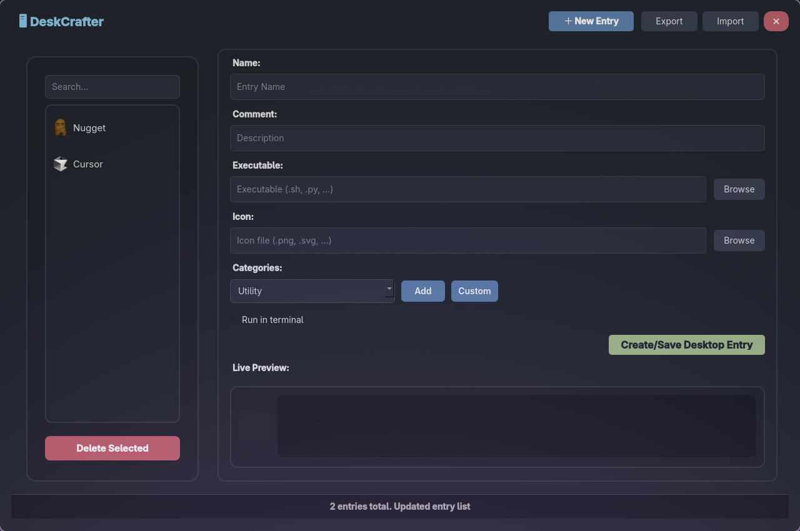

# 🖥️ **DeskCrafter**

> **A beautiful, user-friendly Linux app for creating, managing, and launching custom desktop entries.**

---

## 🚀 Purpose

DeskCrafter aims to make it effortless for users to create and manage application launchers on Linux. When you want your custom script launched as an Application, DeskCrafter provides an intuitive way to do it—no manual editing of `.desktop` files required.

---

> ⚡ **Important:**  
> DeskCrafter can handle both Shell scripts (`.sh`) and Python scripts (`.py`) as launchable files. Simply select your script when creating a new entry(just make sure your scripts are working properly).

---

## ✨ Key Benefits

- 🎯 **Easy Desktop Entry Creation** – No need to remember `.desktop` file syntax.
- 👀 **Live Preview** – Instantly see how your launcher will appear.
- 🖼️ **Icon Picker** – Quickly select or browse for icons.
- 🗂️ **Category Selection** – Organize your entries by category.
- ✏️ **Edit & Delete** – Manage your custom entries with ease.
- 🔒 **Safe** – Entries are created in your user directory, no root required.
- 🖥️ **Modern UI** – Clean, dark-themed interface built with PyQt5.

---

## 🖼️ Screenshots

| Main App Page                         | Example: Selected `.desktop` App              |
| ------------------------------------- | --------------------------------------------- |
|  |  |

- **Left:** DeskCrafter's main interface for managing entries.
- **Right:** Example of editing/viewing a specific `.desktop` entry.

---

## 🛠️ Installation

### Prerequisites

- Python 3.7+
- `python3-venv` and `python3-pip` installed
- Linux desktop environment (GNOME, KDE, XFCE, etc.)

---

### Installation Overview

The `setup.sh` script automates the setup and management of DeskCrafter. It provides:

- **Automated Installation:** Sets up a Python virtual environment, installs dependencies, and creates a launcher and desktop entry for easy access.
- **Interactive Menu:** If run without arguments, presents a menu to install, uninstall, or get help.
- **Dependency Checks:** Verifies that Python 3, `venv`, and `pip` are installed before proceeding.
- **Uninstallation:** Removes the launcher and desktop entry, with an option to remove the virtual environment.
- **Help Option:** Run `./setup.sh help` to see usage instructions.

You can run the script with `install`, `uninstall`, or `help` as arguments, or simply execute it for an interactive menu.

---

### 🚦 Steps

1. **Clone the repository:**

   ```bash
   git clone https://github.com/DhanushSantosh/DeskCrafter.git
   cd DeskCrafter
   ```

2. **Run the installer:**

   ```bash
   ./setup.sh
   ```

   - The script will set up a Python virtual environment, install dependencies, and create a launcher and desktop entry.

3. **Launch DeskCrafter:**
   - From your application menu, search for "DeskCrafter" and launch it.

---

## 📝 Usage

1. **Create a New Entry:**

   - Click the **＋ New Entry** button.
   - Fill in the name, description, category, executable path, and icon.
   - Optionally, check **Run in terminal** if it's a GUI-based file or script.
   - Click **Create/Save Desktop Entry**.

2. **Manage Entries:**

   - Select an entry from the sidebar to edit or delete it.
   - Use the search bar to filter entries.

3. **Live Preview:**
   - See a real-time preview of your `.desktop` file and icon as you edit.

---

## 📂 Uninstallation

To remove DeskCrafter, run:

```bash
./setup.sh uninstall
```

This removes the launcher and desktop entry. To remove the virtual environment, delete the `.venv` folder.

---

## 🤝 Contributing

Pull requests and suggestions are welcome!

---

## 🐞 Issues & Feature Requests

If you encounter bugs or have feature requests, please [open an issue](https://github.com/DhanushSantosh/deskcrafter/issues) on GitHub.

---

## 📄 License

MIT License. See [LICENSE](LICENSE) for details.
